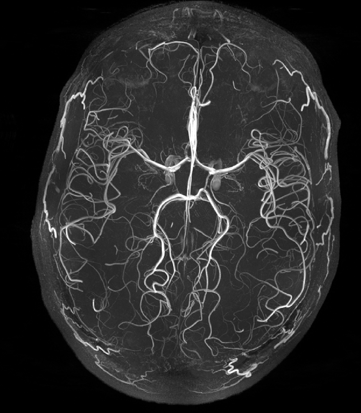
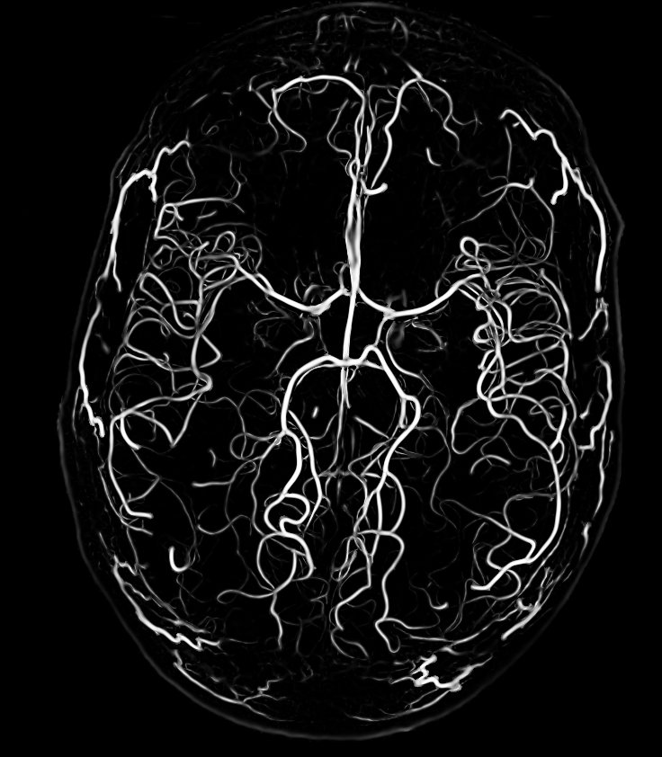

## GPU-based Frangi Filter

For loading/modifying images: [TIRA library](https://github.com/STIM-Lab).

GPU code is added for acceleration.

 
<table>
  <tr>
    <td>Sample input image: 
   beta=1, c=20, range=(1:0.5:3) </td>
     <td>Output image:</td>
  </tr>
  <tr>
    <td></td>
    <td></td>
  </tr>
 </table>

